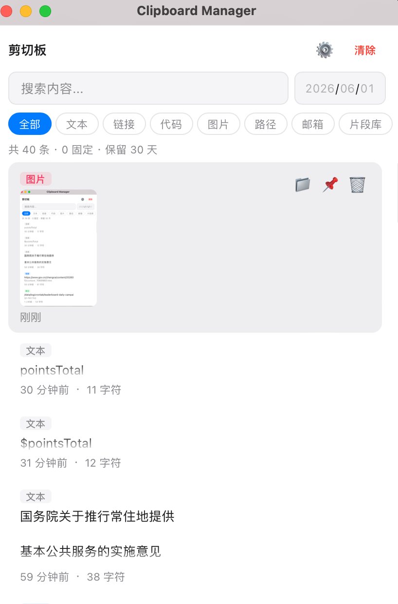

# 📋 Clipboard Manager

一款基于 Wails v3 构建的 macOS 剪切板管理工具，轻量、快速、本地优先。



## 功能特性

### 核心功能
- 🔄 **自动监听** — 实时捕获系统剪切板变化（文本 + 图片），自动保存历史
- 🖼️ **图片支持** — 截图、复制图片自动保存，缩略图预览，一键复制回剪切板
- 🔍 **全文搜索** — 模糊匹配内容，关键词高亮显示
- 📅 **日期筛选** — 日期选择器精确查看某天的记录
- 📌 **固定重要内容** — 固定项不会被清除或过期删除
- 🗑️ **批量清除** — 一键清除所有未固定记录（带确认）

### 菜单栏常驻
- 🖥️ **系统托盘** — 菜单栏显示图标，应用常驻后台
- 🔒 **关闭即隐藏** — 关闭窗口不退出，剪切板监听持续运行
- 👆 **点击唤起** — 点击托盘图标切换窗口显示/隐藏
- 📋 **右键菜单** — 托盘右键菜单提供「显示窗口」和「退出」

### 智能分类
- 自动识别内容类型：**文本**、**链接**、**代码**、**文件路径**、**邮箱**、**图片**
- 彩色标签直观展示
- 按类型快速筛选

### 片段库
- 将常用内容加入命名分组（如「代码模板」「常用地址」）
- 片段库独立查看，方便管理高频使用的文本

### 自动过期清理
- 默认保留 30 天历史，超期自动删除
- 启动时和每小时自动执行清理
- 可在设置中自定义保留天数（1-365 天）
- 固定项永不过期

### 大文本预览
- 超过 200 字符的记录自动截断显示
- 点击「展开预览」查看完整内容
- 预览弹窗支持滚动和一键复制

### 搜索高亮
- 搜索结果中匹配关键词以黄色背景高亮
- 支持亮/暗模式自适应

## 技术栈

| 层级 | 技术 |
|------|------|
| 框架 | [Wails v3](https://v3.wails.io/) |
| 后端 | Go 1.23 |
| 前端 | Vanilla JS + Vite |
| 存储 | SQLite (WAL 模式) |
| 剪切板 | [golang.design/x/clipboard](https://pkg.go.dev/golang.design/x/clipboard) |
| 构建 | [Task](https://taskfile.dev/) |

## 快速开始

### 前置要求

- Go 1.23+
- Node.js 18+
- [Wails v3 CLI](https://v3.wails.io/getting-started/installation/)
- [Task](https://taskfile.dev/)

### 安装 Wails CLI

```bash
go install github.com/wailsapp/wails/v3/cmd/wails3@latest
```

### 开发模式

```bash
wails3 dev
```

前端热重载 + 后端自动重编译。

### 构建

```bash
wails3 task build
```

产物在 `bin/clipboard`。

### 打包为 .app (macOS)

```bash
wails3 task darwin:package
```

产物在 `bin/clipboard.app`，可直接运行或拖入 Applications。

### 打包为 .exe (Windows)

#### 前置要求

- Go 1.23+
- Node.js 18+
- [TDM-GCC](https://jmeubank.github.io/tdm-gcc/) 或 MSYS2（CGo 需要 GCC）
- [Wails v3 CLI](https://v3.wails.io/getting-started/installation/)
- [Task](https://taskfile.dev/)

#### 步骤

```bash
# 1. 安装依赖
go mod tidy
cd frontend && npm install && cd ..

# 2. 生成绑定
wails3 generate bindings

# 3. 构建前端
cd frontend && npm run build && cd ..

# 4. 编译（production 模式，嵌入前端资源）
go build -tags production -ldflags "-H windowsgui" -o bin/clipboard.exe .
```

`-H windowsgui` 隐藏 Windows 控制台窗口，使其作为 GUI 应用运行。

#### 从 macOS 交叉编译 Windows

```bash
# 需要安装 Docker
GOOS=windows GOARCH=amd64 CGO_ENABLED=1 CC=x86_64-w64-mingw32-gcc go build -tags production -ldflags "-H windowsgui" -o bin/clipboard.exe .
```

或使用 Docker 交叉编译（推荐）：

```bash
docker run --rm -v $(pwd):/src -w /src goreleaser/goreleaser-cross:latest \
  go build -tags production -ldflags "-H windowsgui" -o bin/clipboard.exe .
```

### 数据存储位置

| 平台 | 路径 |
|------|------|
| macOS | `~/Library/Application Support/ClipboardManager/` |
| Windows | `%APPDATA%\ClipboardManager\` |
| Linux | `~/.local/share/clipboard-manager/` |

## 快捷键

| 快捷键 | 功能 |
|--------|------|
| `Cmd+Shift+V` | 显示/隐藏窗口 |
| `Cmd+F` | 聚焦搜索框 |
| `Escape` | 清除搜索/关闭弹窗 |
| 点击文本条目 | 复制文本到剪切板 |
| 点击图片条目 | 复制图片到剪切板 |

## 项目结构

```
.
├── main.go                  # 应用入口，窗口、托盘、快捷键配置
├── clipboard_service.go     # 剪切板监听（文本+图片）、分类、片段、清理、图片HTTP服务
├── store.go                 # SQLite 数据层，迁移，分类检测，时间查询
├── frontend/
│   ├── index.html           # 主页面（筛选栏、日期选择器、设置弹窗）
│   ├── src/
│   │   ├── main.js          # 前端逻辑（搜索高亮、图片渲染、片段管理）
│   │   └── style.css        # 扁平化 UI 样式（亮/暗模式）
│   ├── bindings/            # Wails 自动生成的绑定（gitignore）
│   ├── vite.config.js
│   └── package.json
├── build/
│   ├── config.yml           # Wails 构建 & dev_mode 配置
│   ├── appicon.png          # 应用图标 1024x1024
│   ├── trayicon.png         # 菜单栏图标（template icon）
│   └── darwin/
│       ├── Info.plist        # macOS 应用元数据
│       └── icons.icns        # macOS 图标
├── Taskfile.yml             # 构建任务定义
├── go.mod
└── go.sum
```

## 设计决策

- **轮询而非 Watch** — `golang.design/x/clipboard` 的 Watch 在 macOS 上需要主线程 Cocoa 事件循环，与 Wails WebView 冲突，改为 500ms 轮询
- **图片存储为 base64** — 小图直接存 SQLite，通过 HTTP 路由按需提供给前端，避免文件系统管理
- **图片去重** — 使用 SHA256 短哈希比对，避免重复保存相同图片
- **SQLite WAL 模式** — 读写并发不阻塞，适合频繁写入场景
- **去重逻辑** — 连续相同内容不重复保存；自身写入剪切板时跳过捕获
- **自动迁移** — 旧数据库自动添加新列，无需手动操作
- **菜单栏常驻** — 关闭窗口仅隐藏，通过 RegisterHook 拦截关闭事件
- **扁平化 UI** — 跟随系统亮/暗模式，无多余装饰

## 许可证

MIT
